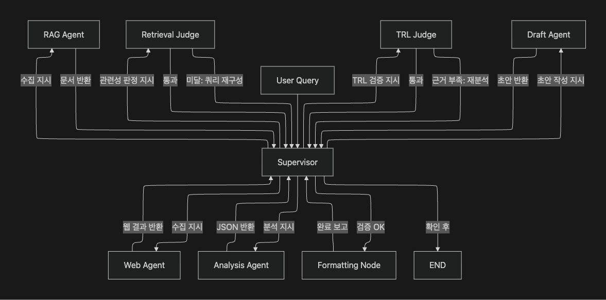

# HBM4/PIM/CXL 기술 전략 분석 AI Agent

HBM4, PIM(Processing-in-Memory), CXL(Compute Express Link) 분야에서 Samsung·Micron의 R&D 동향을 자동 수집·분석하고, R&D 담당자가 즉시 활용 가능한 기술 전략 분석 보고서를 생성하는 Multi-Agent 시스템

## Overview

- **Objective** : 공개 정보(논문, IR, 시장 보고서, 실시간 웹)를 기반으로 경쟁사별 TRL(Technology Readiness Level) 현황과 상용화 리스크를 정량적·정성적으로 분석하여 보고서 자동 생성
- **Method** : LangGraph StateGraph + Supervisor 패턴의 7-Agent 파이프라인. RAG 앙상블 검색 → 실시간 웹 검색 → Retrieval Judge → TRL 분석 → TRL Judge → 보고서 생성 순으로 체계적 검증을 거쳐 최종 PDF 출력
- **Tools** : LangGraph, LangChain, OpenAI API, Tavily Search API, FAISS, BM25, PDFPlumber, ReportLab

## Features

- **PDF 코퍼스 기반 정보 추출** : 논문(ArXiv), IR 보도자료(Samsung·Micron·TSMC), 시장 보고서(TrendForce), 리스크 백서(NFI, JEDEC) 등 12종 PDF를 FAISS + BM25 앙상블로 검색
- **실시간 웹 검색 보완** : Tavily API로 12개 쿼리를 병렬 실행하여 PDF에 없는 최신 동향 보완
- **TRL 단계 정량 판정** : 정규식 기반 TRL Judge가 수치·기업명·기술 고유명사 등 강력 근거를 자동 검증 (LLM 없이 0.01초 내 처리)
- **구조화 JSON → 보고서 자동 생성** : Pydantic 스키마로 분석 결과를 구조화한 뒤 Draft Agent가 한국어 마크다운 보고서로 변환, Formatting Node가 전문 PDF로 출력
- **확증 편향 방지 전략** : RAG 이중 쿼리(긍정 증거 + 리스크 쿼리 병행), 웹 검색 부정 쿼리 우선 배치(예산 절단 시에도 리스크 쿼리 보장), source_type 메타데이터로 IR·학술·리스크 문서 분리, Objectivity Score(리스크 문서 비율 ≥ 20%) 자동 측정, 분석 프롬프트 내 제조사 주장 vs. 리스크 문서 교차검증 강제

## Tech Stack

| Category    | Details                                                  |
|-------------|----------------------------------------------------------|
| Framework   | LangGraph 0.2+, LangChain 0.3+, Python 3.11              |
| LLM         | gpt-4.1 (Draft), gpt-4.1-mini (Analysis · Judge · 라우터) via OpenAI API |
| Retrieval   | FAISS + BM25 Ensemble (α=0.5 / 0.5), Hit Rate@K · MRR 평가 |
| Embedding   | text-embedding-3-small (OpenAI), CacheBackedEmbeddings   |
| Web Search  | Tavily Search API (ThreadPoolExecutor 4-worker 병렬)      |
| PDF Export  | ReportLab Platypus (한글 폰트 · 표 · 페이지 헤더/푸터)    |
| Tracing     | LangSmith (LANGCHAIN_TRACING_V2)                         |

## Agents

- **Supervisor** : 상태 기반 결정론적 라우터. State 플래그 순서로 다음 노드를 결정하며 최대 3회 반복 후 Fallback
- **RAG Agent** : FAISS + BM25 앙상블 리트리버. 긍정 쿼리(k=5)·반론 쿼리(k=3) 이중 검색 후 병합 및 중복 제거
- **Web Agent** : Tavily 실시간 검색. 리스크 쿼리 우선 배치로 12개 쿼리 내 편향 방지 보장
- **Retrieval Judge** : LLM 기반 관련성 점수(0~1) 산출. 0.6 미만 시 쿼리 재작성 후 재검색 (Self-RAG 패턴)
- **Analysis Agent** : gpt-4.1-mini 구조화 출력으로 경쟁사별 TRL·위협 수준·supporting_quotes JSON 생성. 출처 신뢰도 가중치 적용
- **TRL Judge** : 정규식 기반 근거 강도 검증 (LLM 호출 없음). 강력 근거 ≥1개 OR 전체 근거 ≥2개 조건으로 TRL 4~6 구간 엄격 검증
- **Draft Agent** : analysis_json만 입력받아 한국어 마크다운 보고서 작성 (원본 문서 접근 차단으로 할루시네이션 억제)
- **Formatting Node** : 마크다운 정제 + ReportLab 전문 PDF 변환 (섹션 색상 박스, 표 스타일, 페이지 헤더·푸터)

## Architecture

```

```

## Directory Structure

```
AI-SERVICE/
├── data/                    # PDF 코퍼스 (논문·IR·시장보고서·리스크 백서)
├── agents/
│   ├── supervisor.py        # 상태 기반 결정론적 라우터
│   ├── rag_agent.py         # FAISS + BM25 앙상블 (이중 쿼리)
│   ├── web_agent.py         # Tavily 실시간 검색 (편향 방지 쿼리 설계)
│   ├── analysis_agent.py    # TRL 판정 + 경쟁사 분석 (gpt-4.1-mini)
│   ├── draft_agent.py       # 보고서 서술 (gpt-4.1)
│   ├── judges.py            # Retrieval Judge + TRL Judge
│   └── formatting_node.py   # 마크다운 정제 + PDF 생성
├── prompts/
│   ├── analysis_prompt.py   # 출처 신뢰도 가중치·교차검증 지시 포함
│   └── draft_prompt.py      # 보고서 구조 템플릿
├── rag/
│   ├── base.py              # RetrievalChain (FAISS + BM25 Ensemble)
│   └── pdf.py               # PDFRetrievalChain (source_type 자동 태깅)
├── eval/
│   └── evaluate_retriever.py  # Hit Rate@K, MRR, Objectivity Score 평가
├── outputs/                 # 생성 보고서 (*.md, *.pdf) + 지표 (*.json)
├── .cache/                  # 임베딩·FAISS 인덱스 캐시
├── metrics.py               # 런타임 성능 지표 트래커
├── state.py                 # ResearchState TypedDict
├── app.py                   # 실행 진입점
└── requirements.txt
```

## Contributors

- **나우성** : 전체 시스템 설계 및 단독 개발 — Agent 설계, Supervisor 패턴 구현, 확증 편향 방지 전략, Retrieval 앙상블 구성, Prompt Engineering, PDF 렌더링
